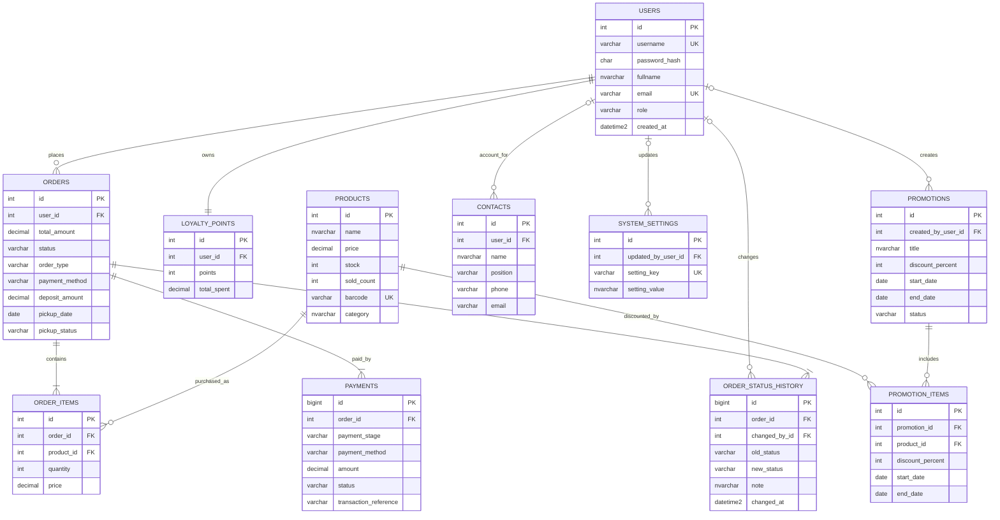

# Chidori Coffee – Full ERD

Migration áp dụng: `migrations/V007_complete_order_schema_and_erd.sql`.

## Luồng dữ liệu chính

- Mỗi `order` thuộc một `user` và chứa nhiều `order_items`.
- Mỗi `order_item` tham chiếu chính xác một `product`.
- Một `promotion` áp dụng cho nhiều `products` thông qua `promotion_items`.
- Thanh toán trực tiếp tạo một dòng `payments` loại `full`.
- Đơn cọc tạo dòng `deposit`; khi khách nhận hàng, trigger tạo dòng `balance`.
- Mọi thay đổi trạng thái đơn được lưu trong `order_status_history`.
